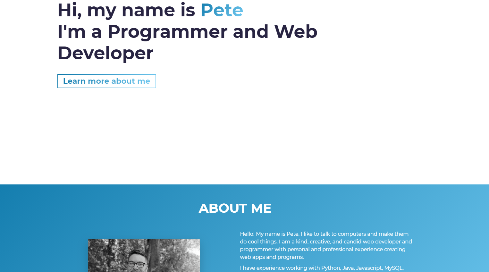

# Employee-Directory

 
 
This application is covered by the Mozilla license.

## Table of Contents
- [Description](#Description)
- [Installation](#Installation)
- [Usage](#Usage)
- [Lincense](#Lincense)
- [Contributing](#Contributing)
- [Tests](#Tests)
- [Questions](#Questions)

## Description  :clipboard:

* This is my new portfolio site. Included on it are links to live versions and the repositories of projects I've finished, a short bio, and contact links.

 
created using ReactJS, GatsbyJS and love :heart:.

## Installation :floppy_disk:
There is no installation for this project

## Usage :warning:
Go to the following site to view/play with the deployed version of this app:
https://peter-izzo.github.io/React-Portfolio/
 

## License :scroll:

 
This application is uses the Mozilla license. 

## Contributors :family:
Peter Izzo

Feel free to submit a pull request with any updates you would like to submit :)

## Tests 🧪
No tests for this project

### Screenshot of Running App

## Questions :question:
### For any issues please reach out to Peter Izzo
 
Feel free to reach out to me at  with any questions :wave: 
 
Check out the rest of my Github: https://github.com/peter-izzo :octocat: 
 

_This README was generated by [README-GEN](https://github.com/peter-izzo/README-GEN) :godmode:_
